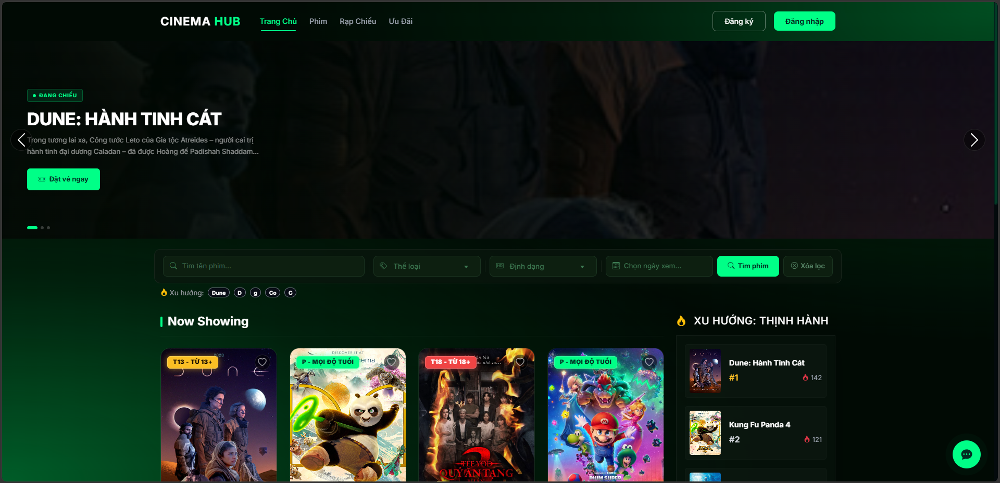
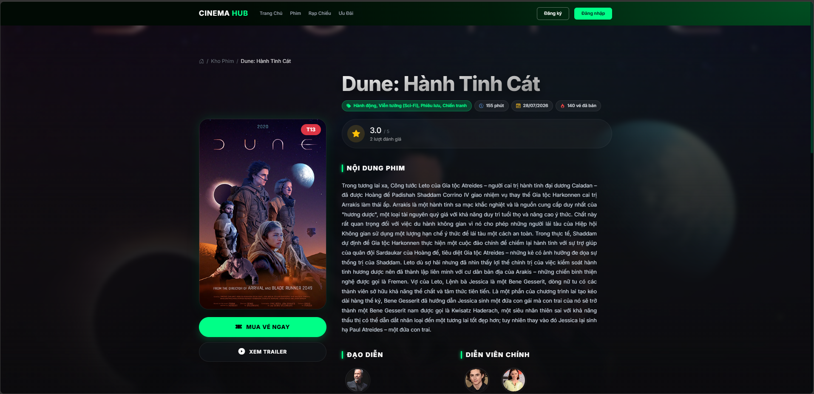
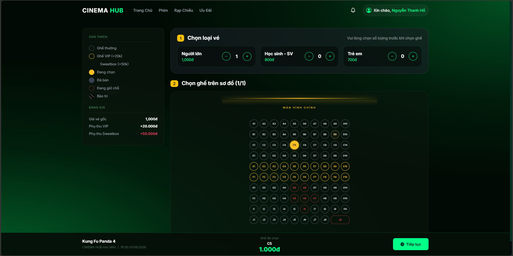
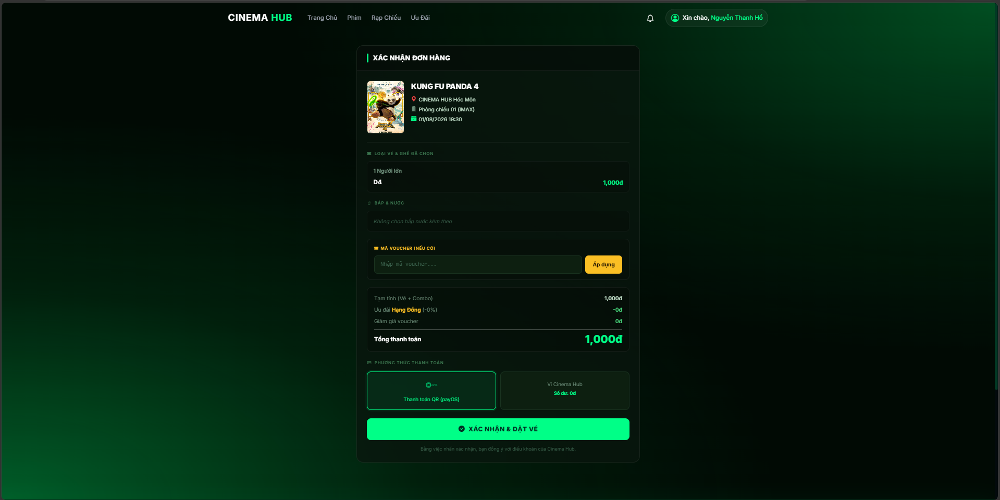
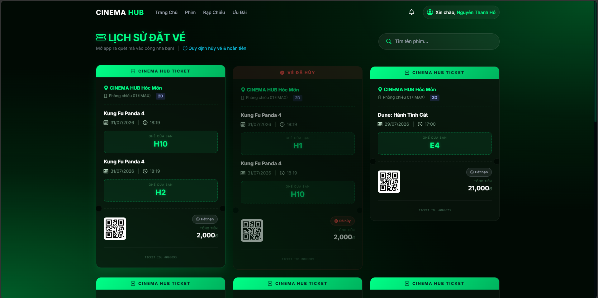

# 🎬 Cinema Hub - Movie Ticket Booking Platform


**Cinema Hub** is a modern, full-stack web application built to streamline movie ticket bookings. The platform ensures a seamless user experience with real-time seat locking, secure online payments, and instant e-ticket generation, making cinema management highly efficient.

> **Status:** 🚀 Completed / Ready for deployment
> 
> **Live Demo:** 🌐 [cinemahub-bdnx.onrender.com](https://cinemahub-bdnx.onrender.com) *(Click to test the live application!)*

---

## 💻 Screenshots

<!-- HƯỚNG DẪN THÊM ẢNH: 
1. Bạn tạo một thư mục tên là "Captures" ngay trong repo Github của dự án.
2. Chụp ảnh màn hình web của bạn, đổi tên tương ứng (home.png, booking.png...) rồi up vào thư mục đó.
3. Nếu bạn đặt tên khác, chỉ cần sửa lại chữ "Captures/tên_ảnh_của_bạn.png" ở các thẻ  bên dưới.
-->

| Home Page | Movie Details | Seat Booking |
|:---:|:---:|:---:|
|  |  |  |
| **Payment (PayOS)** | **E-Ticket (QR Code)** | **Admin Dashboard** |
|  |  |  |

---

## ✨ Key Features & Tech Stack

### 🎫 Real-Time Seat Reservation
- **Concurrency Control:** Utilizes `SignalR` to synchronize seat locking in real-time across all active users.
- **Double-booking Prevention:** Ensures that once a seat is selected by a user, it becomes instantly unavailable to others until checkout is complete.

### 💳 Secure Payment Workflow
- **PayOS Integration:** Seamlessly processes online transactions using the PayOS payment gateway API.
- **Automated E-Tickets:** Generates digital tickets with scannable QR codes (via `QRCoder`) immediately upon successful payment.

### 🔐 Authentication & Security
- **Role-Based Access Control (RBAC):** Distinct interfaces and permissions for `Admin` and `User`.
- **Google OAuth:** Fast and secure social login alongside standard `ASP.NET Core Identity` authentication.

### 🗄️ Robust Backend Architecture
- **Frameworks:** C#, ASP.NET Core 8 MVC, HTML5, CSS3, Bootstrap.
- **Database:** Optimized relational database design utilizing `PostgreSQL` and `Entity Framework Core`.
- **Docker Ready:** Containerized setup for easy deployment and testing across different environments.

---

## 🚀 How to Run Locally

1. **Clone the repository:**
   
   ```bash
   git clone https://github.com/chunne130/DoAnDatVeXemPhim.git
   cd DoAnDatVeXemPhim
   ```

2. **Setup Database & Run Application:**
   
   - Update the Connection String in `appsettings.json` with your local PostgreSQL credentials.
   - Run Entity Framework migrations and start the server:
   
   ```bash
   dotnet ef database update
   dotnet run
   ```
   
   *The application will be available at `https://localhost:5001` (or the port specified in your launch settings).*

---

## 🔮 Roadmap

- [x] Basic user authentication & Google OAuth
- [x] Role-Based Access Control (Admin/User)
- [x] Real-time seat reservation with SignalR
- [x] Online Payment integration via PayOS
- [x] QR Code e-ticket generation
- [ ] Add Email/SMS ticket confirmation
- [ ] Implement AI-based movie recommendation
- [ ] Multi-language support (English/Vietnamese)

---

## 🤝 Contributing

Contributions are welcome! If you'd like to improve Cinema Hub, please follow these steps:

1. Fork the project.
2. Create your feature branch (`git checkout -b feature/your-feature`).
3. Commit your changes (`git commit -m "Add your feature"`).
4. Push to the branch (`git push origin feature/your-feature`).
5. Open a Pull Request.
